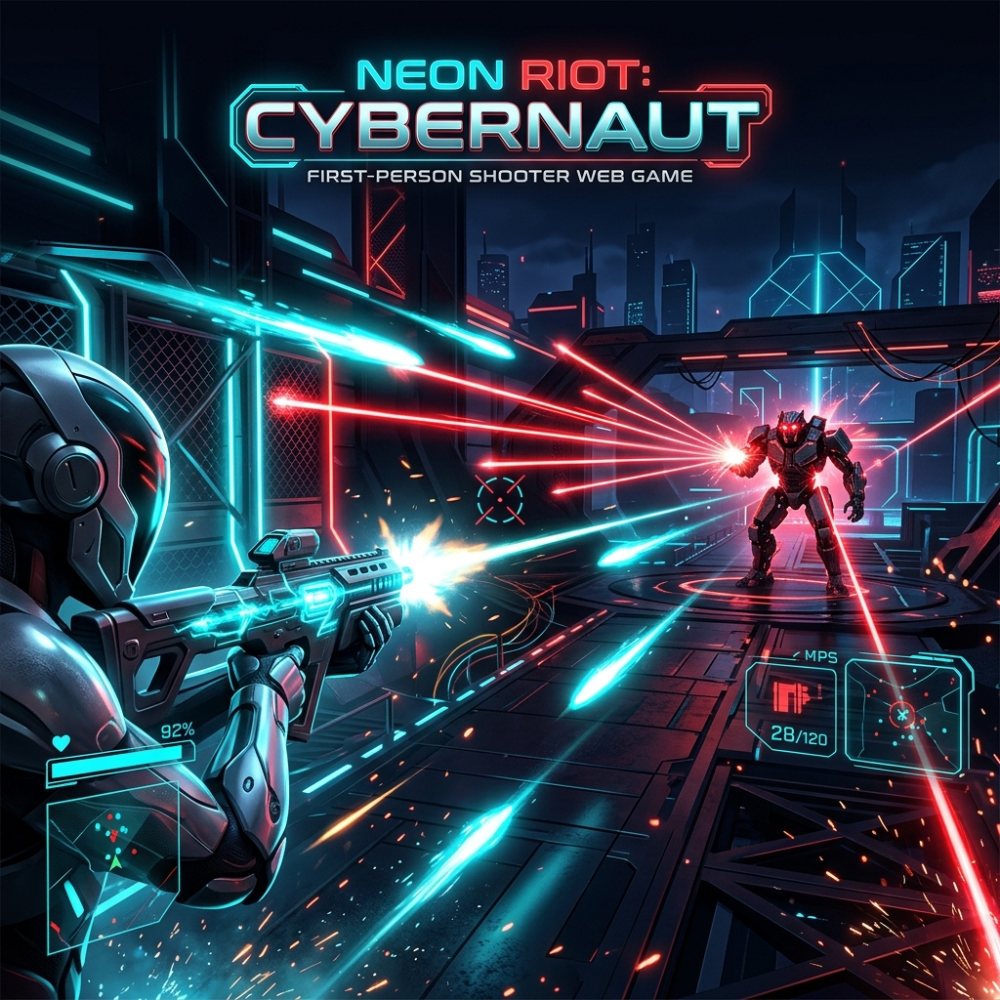

<div align="center">
  

  # 🚀 Neon Horizon: 3D Web FPS

  *A lightning-fast, physics-based 1st Person Shooter built entirely in the browser using React Three Fiber and Rapier Physics.*

  [](https://react.dev/)
  [](https://threejs.org/)
  [](https://vitejs.dev/)
  [](https://docs.pmnd.rs/zustand)
</div>

---

## 🌌 Overview

**Neon Horizon** is a high-octane 3D web-based shooter. Step into a minimalist sci-fi arena where reflexes and positioning mean the difference between victory and defeat. Built with modern web technologies, this game brings desktop-grade physics and fluid mechanics directly to your browser.

Dodge glowing physical laser beams, take cover behind towering pillars, and outmaneuver an intelligent patrol AI in a battle to the death!

---

## 🎮 Key Features

- 🔫 **Physical Projectile Combat:** No instant hit-scan! Both you and the enemy fire dynamic, physics-based laser beams with real travel time. Master the art of leading your shots and physically dodging incoming fire.
- 🤖 **Simultaneous AI Combat:** An intelligent enemy AI that relentlessly patrols the arena while actively tracking you and laying down suppressive fire the moment you enter its line of sight.
- 🛡️ **Interactive Environment:** Lasers physically react to the world. Duck behind the pink and blue neon pillars to block incoming shots.
- 🎲 **Tactical Spawning System:** Every match feels fresh with 5 unique, balanced spawn configurations. Your camera auto-aims at the enemy the moment the match begins so you're always ready for action.
- 🎚️ **Adaptive Difficulty:** Choose your challenge! From the forgiving *Easy* mode (slower enemy fire and lower accuracy) to the brutal *Hard* mode (relentless, pinpoint-accurate fire).
- 💻 **Glassmorphic UI:** A beautifully crafted, modern glass UI that responds to your mouse movements and anchors the futuristic aesthetic.

---

## 🛠️ Technology Stack

This project was built from the ground up using the cutting edge of the 3D Web ecosystem:

* **Framework:** [React 18](https://react.dev/) + [Vite](https://vitejs.dev/)
* **3D Rendering:** [Three.js](https://threejs.org/) via [React Three Fiber (@react-three/fiber)](https://docs.pmnd.rs/react-three-fiber/getting-started/introduction)
* **Physics Engine:** [Rapier Physics (@react-three/rapier)](https://rapier.rs/)
* **Helpers & Controls:** [@react-three/drei](https://github.com/pmndrs/drei)
* **State Management:** [Zustand](https://github.com/pmndrs/zustand)
* **Styling:** Vanilla CSS3 with modern flexbox, CSS variables, and glassmorphism techniques.

---

## ⌨️ Controls

| Action | Key/Input |
| :--- | :--- |
| **Move Forward** | `W` or `↑` |
| **Move Backward** | `S` or `↓` |
| **Strafe Left** | `A` or `←` |
| **Strafe Right** | `D` or `→` |
| **Look Around** | `Mouse Movement` |
| **Fire Laser** | `Left Click` |

---

## 🚀 Getting Started

Want to run the arena on your own machine? It's incredibly easy to set up.

### Prerequisites
Make sure you have [Node.js](https://nodejs.org/) installed on your machine.

### Installation

1. **Clone the repository:**
   ```bash
   git clone https://github.com/JeffTiong1031/3D_FPS_ShootingGame.git
   cd 3D_FPS_ShootingGame
   ```

2. **Install dependencies:**
   ```bash
   npm install
   ```

3. **Start the development server:**
   ```bash
   npm run dev
   ```

4. **Play the game!**
   Open your browser and navigate to `http://localhost:5173`. Click the difficulty of your choice and step into the arena!

---

<div align="center">
  <p>Built with ❤️</p>
</div>
